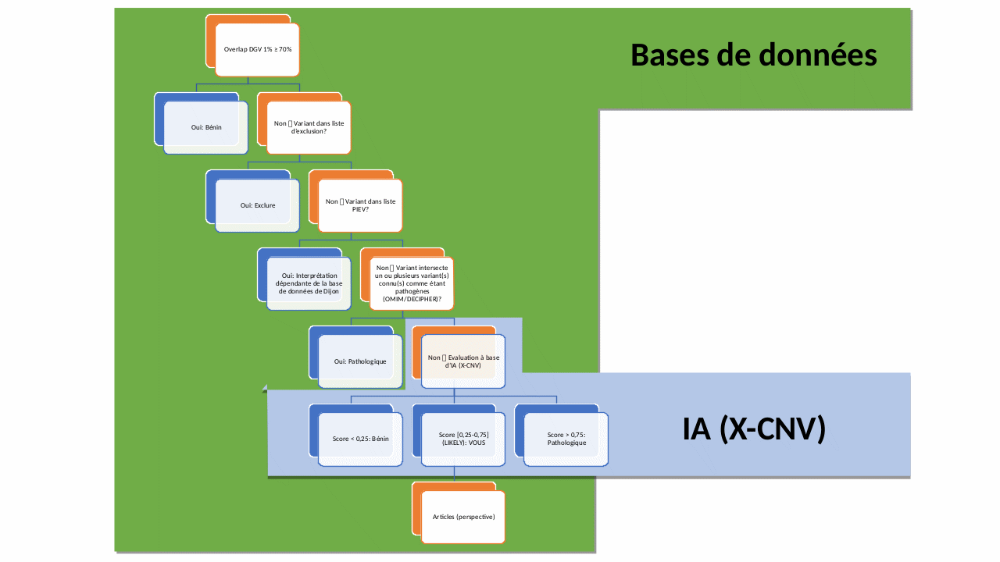

# Groupe 1 Datahon 2022
## \#Genetic VOUS IA
Défi n°1
Développer un outil de classification des variations génomiques de signification inconnue ou VOUS

Lors d'une analyse chromosomique, il y a la mise en évidence d'anomalies chromosomiques. Cela peut être une supression d'un morceau on appelle cela délétion ou alors l'ajout d'un morceau, on appelle cela gain
Pour pouvoir définir si cette anomalie peut comporter un risque pour la personne, on utilise le diagramme ci-dessous
On propose aussi l'intégration de l'outil X-CNV (https://github.com/kbvstmd/XCNV)

## Installation

A Release package is available [here](https://github.com/Teuira/cnvhub/releases).
Instructions to get started inside the released zip file.

## Contributeurs

- [@Teuira](https://github.com/Teuira/)
- [@SimonLrch](https://github.com/SimonLrch)

## XCNV

Zhang L, Shi J, Ouyang J, Zhang R, Tao Y, Yuan D, Lv C, Wang R, Ning B, Roberts R, Tong W, Liu Z, Shi T. X-CNV: genome-wide prediction of the pathogenicity of copy number variations. Genome Med. 2021 Aug 18;13(1):132. doi: 10.1186/s13073-021-00945-4. PMID: 34407882
https://github.com/kbvstmd/XCNV

## License

[MIT](https://choosealicense.com/licenses/mit/)
